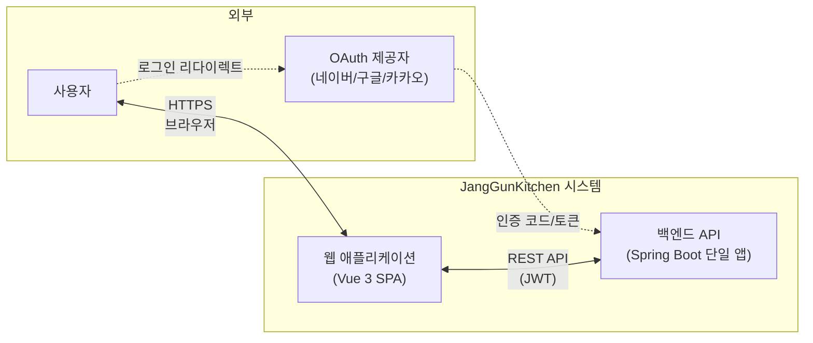
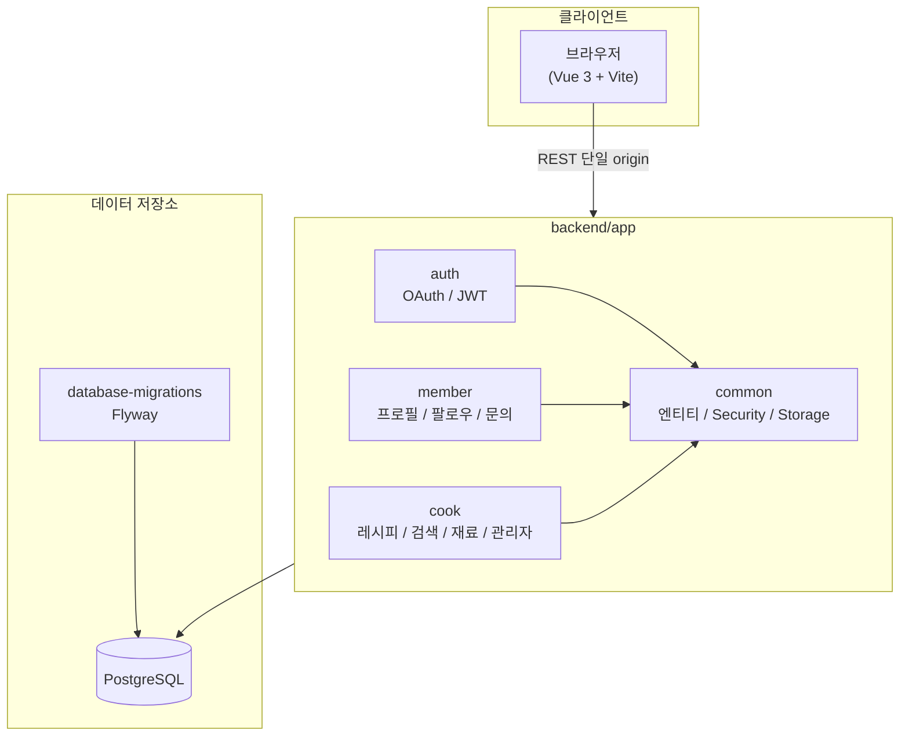
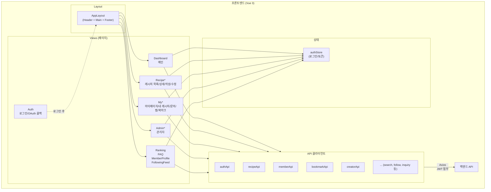
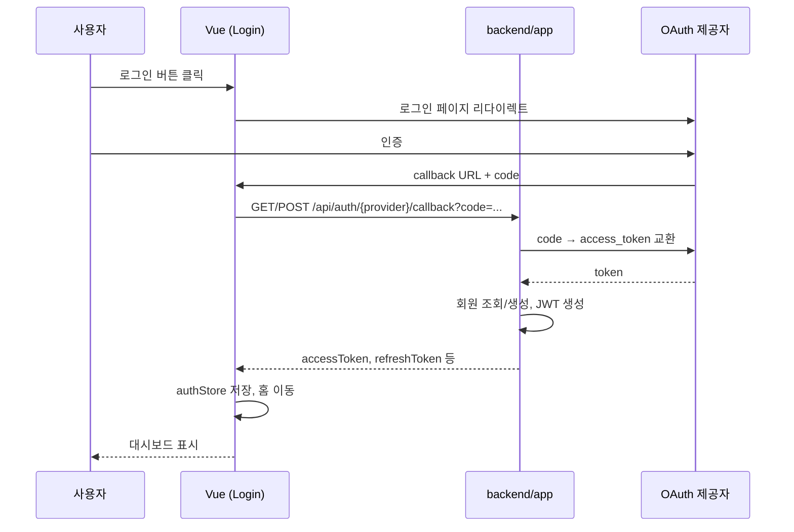
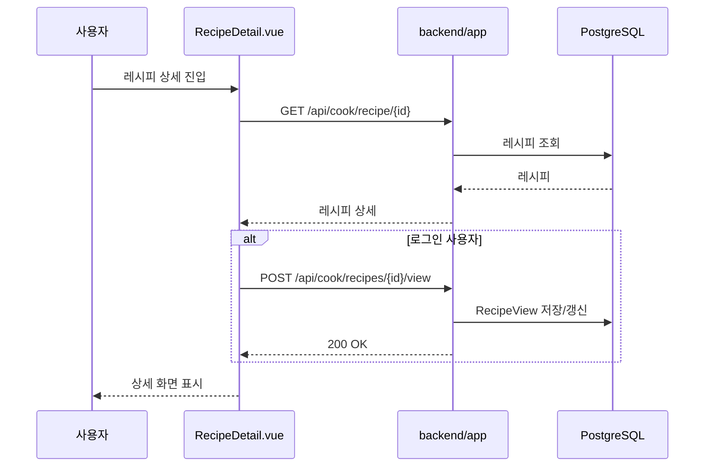
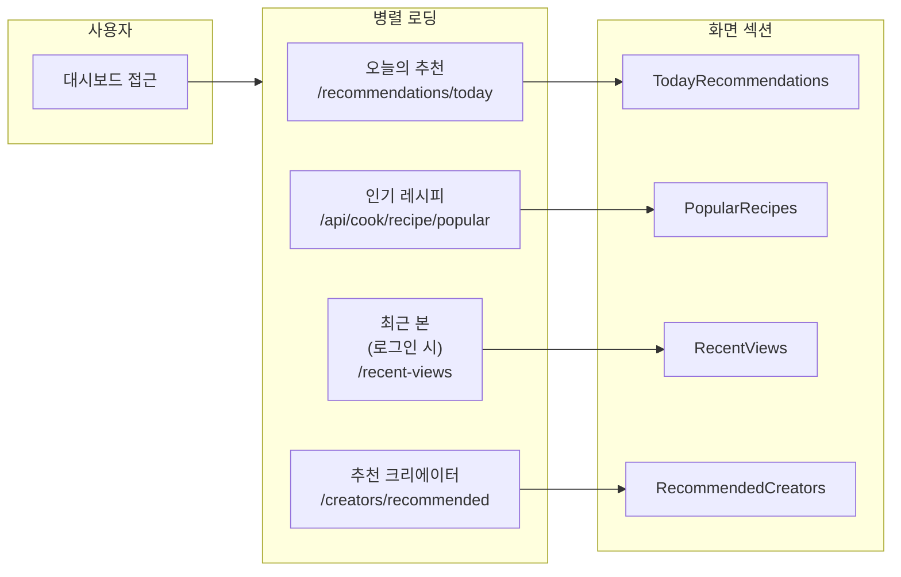
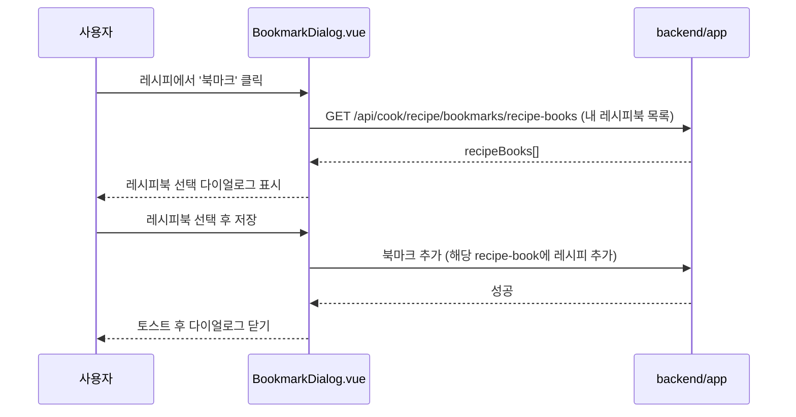

# 장군의부엌 아키텍처 정의서

## 문서 정보

| 항목 | 내용 |
|------|------|
| 프로젝트명 | JangGunKitchen |
| 문서명 | 아키텍처 정의서 |
| 버전 | 1.3 |
| 작성일 | 2026-09-01 |
| 최종 수정일 | 2026-09-01 |

---

## 1. 개요

본 문서는 **장군의부엌** 애플리케이션의 **시스템 구성**, **서비스 아키텍처**, **주요 데이터·처리 흐름**을 도식으로 정리한다.  
Flow 차트 및 다이어그램은 Mermaid를 사용하며, 뷰어에서 렌더링하면 한 눈에 구조를 파악할 수 있다.

---

## 2. 시스템 컨텍스트

시스템 외부 액터와 JangGunKitchen과의 관계를 나타낸다.



---

## 3. 백엔드 구성

백엔드는 **단일 Spring Boot 애플리케이션**이다. 도메인 패키지(`auth` / `member` / `cook` / `common`)로 나뉘며, Flyway SQL은 `database-migrations` 모듈이 담당한다. HTTP prefix는 기존 프론트와 호환되도록 유지한다.



---

## 4. 도메인별 역할 요약

| 패키지 | 역할 | 주요 API Prefix |
|--------|------|-----------------|
| **auth** | OAuth 로그인, JWT 발급/갱신/로그아웃 | /api/auth |
| **member** | 회원 프로필, 팔로우, 1:1 문의 | /api/member |
| **cook** | 레시피·댓글·북마크·찜·조회·추천·크리에이터·검색·재료·관리자·공통코드 | /api/cook |
| **common** | 공유 엔티티(Member, Follow, CommonCode), 보안, 스토리지, 예외, `/health` | /health |

---

## 5. 프론트엔드 구조

프론트엔드는 **단일 SPA**이며, 레이아웃·라우터·상태·API 계층으로 구분된다.



---

## 6. 주요 처리 흐름

### 6.1 로그인 흐름 (OAuth + JWT)



### 6.2 레시피 상세 조회 및 조회 기록



### 6.3 대시보드 데이터 로딩 (병렬)



### 6.4 레시피 북마크 저장 흐름



---

## 7. 기술 스택 요약

| 구분 | 기술 |
|------|------|
| **프론트엔드** | Vue 3, TypeScript, Pinia, Vue Router, PrimeVue, Vite |
| **백엔드** | Java 21, Spring Boot 3.5, Spring Security, JPA, QueryDSL |
| **DB** | PostgreSQL |
| **인증** | JWT, OAuth2 (네이버/구글/카카오) |
| **기타** | Spring Scheduler (인기 점수 등 배치성 작업), Flyway (`database-migrations`) |
| **로컬 기본** | API `http://localhost:8080`, 프론트 `VITE_API_BASE_URL` 단일 변수 |

---

## 8. 디렉토리 구조 (참고)

```
JangGunKitchen/
├── frontend/                 # Vue 3 SPA
│   ├── src/
│   │   ├── api/              # API 클라이언트 (단일 VITE_API_BASE_URL)
│   │   ├── components/
│   │   ├── layout/
│   │   ├── router/
│   │   ├── stores/
│   │   ├── types/
│   │   ├── views/
│   │   └── main.ts
│   └── ...
├── backend/
│   ├── app/                  # 단일 Spring Boot 앱
│   └── database-migrations/  # Flyway SQL
└── docs/
```

---

## 9. 변경 이력

| 버전 | 일자 | 변경 내용 |
|------|------|-----------|
| 1.0 | 2026-09-01 | 최초 작성(시스템·서비스·프론트 구조 및 주요 플로우), 3개 서비스+공통 라이브러리를 `backend/app` 단일 애플리케이션으로 통합. API prefix 유지, 프론트 base URL 단일화, 대시보드 인기 API 경로 정정(`/api/cook/recipe/popular`), 로컬 포트·`VITE_API_BASE_URL`·Flyway 명시. docs 전수 현행화 |
